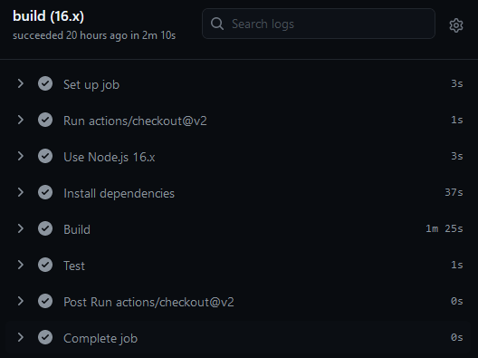
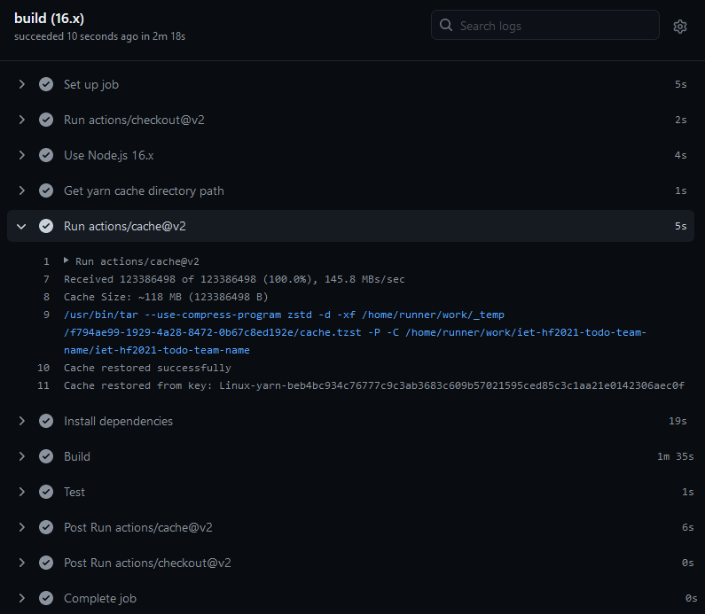
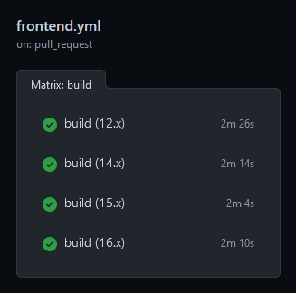
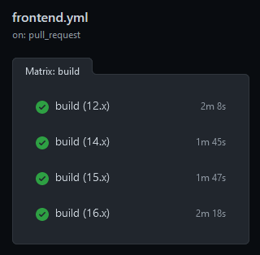
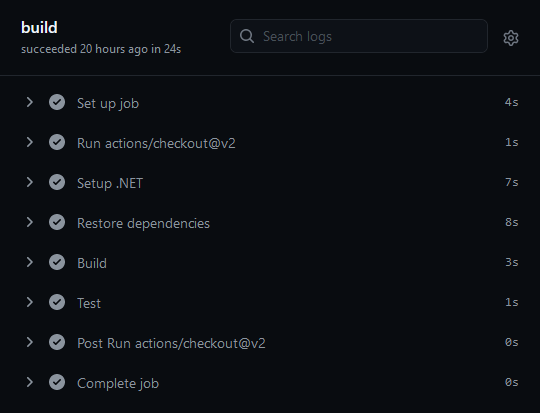
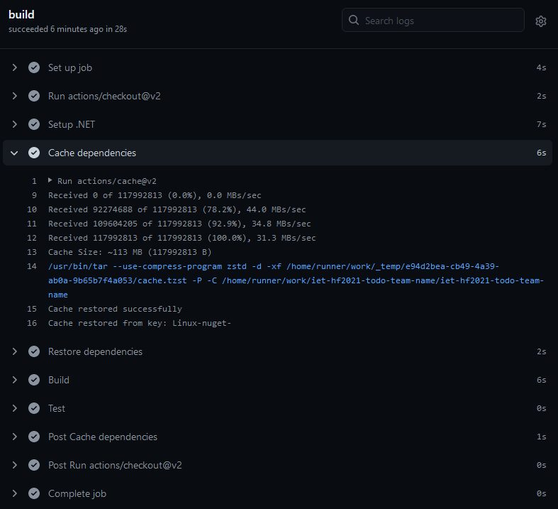

# Folytonos integráció 

## Github Actions
A projekt folytonos integrációjának elvégzésére kerestünk lehetőségeket. Több szolgáltató képességeit összehasonlítottuk, míg végül a GitHub saját, Actions nevű funkcióját választottuk. A választásnál fontos szerepet játszott, hogy szeretnénk mindkét, különböző technológiákra épülő rész integrációját egyazon rendszerben nyomon követni. További előnye, hogy a konfiguráció egyszerű és flexibilis. A számos előre elkészített minta segítségével könnyen beüzemelhető, majd igény szerint bővíthető, testreszabható.

## A kiinduló konfigurációk
Az Action-ök alap esetben a repo gyökerében futtatják le a kiadott parancsokat. Mivel mindkét rész saját mappájában kapott helyet, meg kell adni ezek relatív elérési útvonalát. 
Ezen felül megfontolandó a futást kiváltó események pontos definiálása. Kezdetben ez szinte mindig a főágon történő változások és a főágra létrehozott pull requestek változásait foglalja magában. Jelen esetben ez elégséges, így ezek megváltoztatása nem szükséges.

### Frontend
https://github.com/actions/starter-workflows/blob/main/ci/node.js.yml
Mivel a projekt eredetileg Yarn-al készült NPM helyett, kissé változtatni kellett a kiadott parancsokon. A Yarn parancssori paraméterei sem egyeznek meg az NPM-el. 
Folytonos integrációs környezetben javasolt a függőségek telepítését mindig tiszta környezetben elvégezni, azaz üres node_modules mappával, hiszen így nem fordulhat elő, hogy egy olyan függőség mellett buildelünk, amely nem szerepel a package.json-ban. Továbbá a megismételhetőség érdekében érdemes kizárólag a lock-fájl alapján meghatározni a szükséges függőségeket és azok verzióját.

Ennek értelmében a `npm install` és `yarn install` nem használható, mivel ezek akkor is lefutnak, ha a node_modules mappa nem üres, illetve újabb verziókat is letölthetnek, ha a package.json megengedi. NPM esetén az `npm ci` elkerüli ezeket a problémákat. Yarn esetén a `yarn install --frozen-lockfile` használható, ami ugyan nem követeli meg az üres node_modules mappát, kizárólag a lock-fájlt használja. A legtöbb esetben ez nem jelent problémát, mivel a node_modules mappát nem javasolt commitolni és cachelni sem.

A Node.js meglehetősen gyakran, fél évente ad ki új "major" verziót, míg a szerverek ezt nem feltétlenül követik. Emiatt érdemes több különböző verzióval is lefuttatni a projektet, hogy megbizonyosodjunk a korábbi verziókkal szembeni kompatibilitásról. Erre az alap konfigurációs sablon elkészítésénél is gondoltak, így nincs más dolgunk mint beállítani a vizsgálni kívánt verziószámokat a `strategy-matrix-node-version` tömbben. Az itt megadott verziók egymással párhuzamosan futnak le, így nem növelik meg a teljes integrációs folyamat hosszát sem.

A kód helyének megadása:
```
defaults:
  run:
    working-directory: ./frontend
```
### Backend
https://github.com/actions/starter-workflows/blob/main/ci/dotnet.yml
A backend fordítására és a tesztek futtatására teljesen megfelelők az előre megadott parancsok, ezeken módosítani nem szükséges.

A kód helyének megadása a frontendhez hasonlóan:
```
defaults:
  run:
    working-directory: ./backend
```

## Caching
A folytonos integráció akkor hatékony, ha a fejlesztők a commit elküldése után a lehető legrövidebb időn belül visszajelzést kapnak az elvégzett módosításaikról. Éppen ezért érdemes megfontolni milyen lehetőségeink vannak a workflowk lerövidítésére. Jelen esetben a projekt mindkét része számtalan külső függőséggel rendelkezik, amiket az adott környezet csomagkezelői minden build folyamat előtt letöltenek. Mivel ezek elég ritkán változnak, egyértelműen látszik, hogy ezeket akár elég lenne egyszer is letölteni. A GitHubnál is gondoltak erre és létrehozták a [cache]( https://github.com/actions/cache) Actiont. Ennek segítségével perzisztensé tehetjük a futások során letöltött függőségeket, amiket a GitHub egy különálló tárhelyen (egy ideig) eltárol a lock-fájl tartalmából képzett hash segítségével. Az ez után végrehajtott workflowk már képesek visszatölteni a megfelelő függöségeket, amennyiben a lock-fájl hashelt értéke nem vátlozott meg.

### Frontend
Összehasonlítás:\
Cache nélkül:\
\
Cache találattal:\
\
Mint látható kb. 30%-kal kevesebb ideig tartott a függőségek betöltése cache találat esetén. Sajnos az idő nagyrésze a React fordítással telik, amin a függőségek cachelése nem befolyásol. Ennek csökkentésére most nem találtunk megoldást. 

Hasonló eredményeket láthatunk minden kiválasztott Node.js verzióval történő futtatáskor:\
Cache nélkül:\
\
Cache találattal:\


### Backend
Összehasonlítás:\
Cache nélkül:\
\
Cache találattal:\
\
A frontenddel szemben a .NET sokkal gyorsabban lefordul. Látható, hogy ebben az esetben nem befolyásolta mérhetően a workflow sebességét a cachelés.
Ennek ellenére nagyobb projektek és lokális futtatók használata esetén így is hasznos lehet.

## Összefoglalás
Sikeresen beállítottuk a projekt mindkét részének folytonos integrációját a GitHub Actions segítségével és megvizsgáltuk a függőség gyorsító tárazás hatását is. Egy, yml konfigurációs fájlokkal rendkívül jól testreszabható rendszert ismertünk meg, ami a későbbiekben hasznos visszajelzést adhat a fejlesztők munkájáról és a kód állapotáról.
