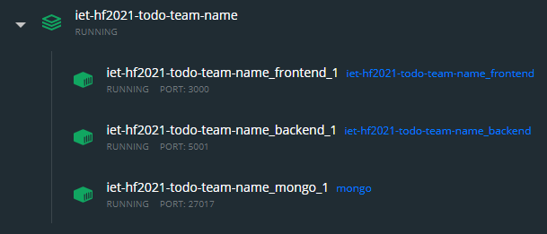

# Deployment (Docker)

A projekt részei külön-külön könnyen, néhány egyszerű parancs kiadásával lefordíthatók. Azonban, ha már egy tényleges szerverre szeretnénk telepíteni és frissíteni, hamar rájöhetünk, hogy bonyolult konfigurációkat kell elvégezni minden egyes alkalommal. Ennek egyszerűsítése érdekében létrehoztuk a projekt „konténerizálásához” szükséges fájlokat, melyekkel könnyen elkészíthetjük mindkét rész Docker konténerét.\
A konténerek létrehozásához a projekt gyökerében a `docker-compose build` parancsot kell kiadni. A konténerek elkészítése során, a projekt elemei lefordulnak, így csak a futtatáshoz szükséges fájlokat tartalmazzák, ezzel jelentősen lecsökkentve a rendszer indításához szükséges időt.\
A futtatáshoz a `docker-compose up -d` parancsot kell futtatni, míg a leállításhoz a `docker-compose down`-t. Mivel az alkalmazás önmagában nem képes adatok perzisztens tárolására, futtatás előtt egy MongoDB konténer is letöltésre kerül.

## Összefoglalás
A docker konténerek elkészítésével jelentősen megkönnyítettük a teljes projekt elindítását és frissítését. A jelenlegi konfigurációban sajnos nem tudtuk megoldani, hogy az elkészült konténerekben futó frontend és backend hiba nélkül tudjon egymással kommunikálni (CORS Policy error). Ez egy éles környezetben, valódi domain név használata esetén megoldódna.
