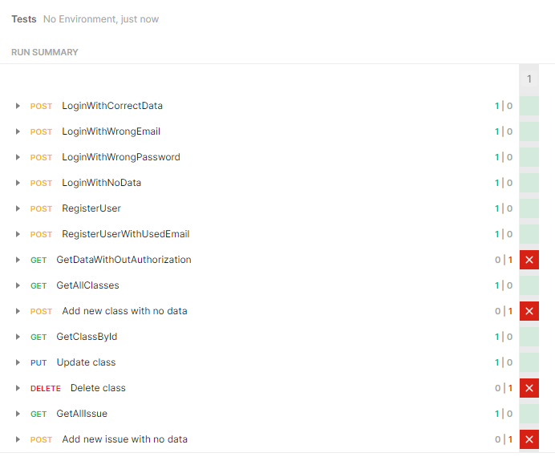

# Manuális tesztek megtervezése, végrehajtása és dokumentálása

## A munka leírása
A manuális tesztelés célja, hogy olyan szituációkat, eseteket teszteljen, olyan hibákat keressünk, amiket az automatikus teszteknek nem sikerül felfednie.

A manuális tesztek során elsősorban nem a modellt, hanem az API-t és a felhasználói felületet kellett tesztelni, megbizonyosodni róla, hogy az elvárt funkciókhoz képest milyen hibákat találunk bennük.

## Manuális tesztelés típusok
- White Box Testing
- Black Box Testing
- Gray Box Testing

Ebben a tesztelésben **Black Box Testing**-et alkalmazunk, amikor a tesztelő az applikáció funkcionalitását ellenőrzi a felhasználó szemszögéből. Black box tesztelésnél a programkódot figyelmen kívül hagyjuk, ezért nem látjuk a program belső futását.

## A kliensoldal tesztelése

Teszt neve | Eredmény
---------- | --------
Login oldal | sikeres
Regisztráció oldal | sikeres
Authorizáció | sikeres
Új feladat | sikertelen
Feladat szerkesztés | sikertelen
Új munkaterület | sikertelen
Feladat mozgatása az oszlopok között | sikertelen
Új tárgy | sikertelen
Tárgy szerkesztése | sikertelen
Új címke | sikeres
Címke törlése | sikertelen

### Az eredmények:
- A bejelentkezésben nem találtam hibát. XSS támadással sem sikerült bug-ot okoznom. 
- A regisztrációnál nem lehet ugyanolyan email címmel regisztrálni, de ugyanolyan névvel igen.
- Az authorizáció rendben működik. Nem lehet anélkül a védett oldalakat elérni.
- Új feladat/esemény létrehozásakor adatok nélkül is lehet elmenteni feladatot.
  * Új feladatkor nem létező címkével is lehet menteni feladatot.
  * Új eseménykor az esemény végi dátum korábban is lehetséges mint a kezdeti dátum.
  * Új eseménykor negatív időtartammal is lehet eseményt létrehozni.
- Létrehozott eseményen való kattintással való szerkesztés nem működik.
- Új munkaterület létrehozása
    * név megadás nélkül nem lehetséges, de a felhasználó nem kap visszajelzést.
    * után feladat hozzáadásakor a felhasználói felület nem frissül, csak az oldal frissítése után
- Meglévő munkaterületen a feladatok mozgatása csak az oldal frissítése után látható
- Meglévő munkaterületen a saját oszlopába mozgatni a feladatot hozzáadja még egyszer a munkaterülethez.
- Új tárgy létrehozása tárgynév nélkül lehetséges.
- Új tárgy létrehozása, majd szerkesztése után a tárgy eltűnik(a tárgy user_id-ja null lesz)
- Új címkék létrehozása ugyanolyan néven nem lehetséges.
- Új címke felvétele, majd azonnali törlése nem lehetséges.

## A backend tesztelése Postmannel

Postman használatakor egy kollekcióba szerveztem a tesztelést, azon belül mappákba, amik bizonyos részét tesztelik az API-nak.
A tesztelés során használtam a beépített postman tesztelést, valamint a változókat, pl($randomEmail).

Az összesítésből kiderül, hogy a bejelentkezés, regisztráció megfelelően működik. Az authorizáció egy esetben nem működik, amikor az összes felhasználót lekérdezzük, ahhoz nem szükséges.

### Bugok:

* Létre lehet hozni osztályt adat nélkül is.
* Csak azokat az osztályokat lehet módosítani, lekérdezni, törölni, amiknek nem null a UserId-ja.
* Létre lehet hozni új feladatot/eseményt adatok nélkül.