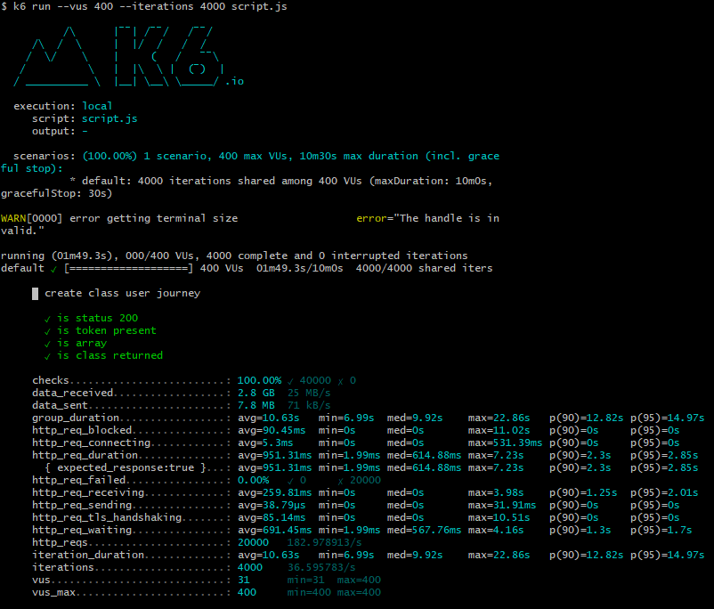

# Nem funkcionális jellemzők vizsgálata

## Biztonság

A weboldal használata csak bejelentkezés után lehetséges, a nem bejelentkezett felhasználókat az oldal átirányítja a bejelentkezési felületre. Az autentikáció és autorizáció JSON Web Tokenek segítségével történik, viszont ennek aláírása egy hetes időtartamra történik. Ezen megközelítés biztonsági problémákat jelenthet, ugyanis nincs megoldás az egyes tokenek visszavonására, így egy felhasználó kitiltásakor például még egy hétig fogja tudni használni az alkalmazást, akkor is, ha bejelentkezni már nem tudna. Ez azért lehetséges, mert az alkalmazás nem generál minden munkamenethez új tokent, hanem egyszerűen eltárolja a böngésző LocalStorage API-ján keresztül azt, és minden alkalommal, amikor az oldal megnyitja a felhasználó, előveszi azt. Így a token könnyedén elérhető JavaScriptből is, ezzel a Cross Site Scripting (XSS) biztonsági kockázatát növelve.

A biztonsági teszthez az OWASP ZAP alkalmazását használtuk, melynek segítségével több, különböző eszközzel lehet támadni az oldalt. A következő sérülékenységeket találtuk ezzel:

- Az X-Frame-Options header nincs beállítva, ezáltal lehetségessé válhat az oldal beágyazása máshol.
- Az X-Content-Type-Options header sincs beállítva, ezzel megtilthatjuk a böngészőnek azt, hogy a MIME típust megpróbálja intelligensen kitalálni, ahelyett, hogy a szervertől kapott típusként renderelné azt le. Ez bizonyos phishing támadásokra adna lehetőséget.
- Az X-Powered-By header viszont be van állítva, ezzel jelezve mindenkinek, hogy milyen szerverrel szolgáljuk ki a kéréseket. Ez az információ nagyon hasznos lehet a támadónak, hiszen mostmár tudja, hogy milyen rendszer sérülékenységeit kell megpróbálnia kihasználni.

Az alkalmazás nem tartalmazott kritikus sérülékenységeket a fentieken kívül.

## Jelszó biztonság

A jelsző biztonság külön problémás az alkalmazásban. A regisztrációs felületen van validáció a bemeneteken, ez legalább 5 és legfeljebb 32 karakteres bemeneteket vár el. Mind az alsó, mind a felső határ túl alacsony, az 5 karakteres jelszavak nem megfelelően komplexek, míg valójában nincs okunk a jelszó hosszát mindössze 32-ben korlátozni, miközben ennél hosszabb jelszavakat is használhatna a felhasználó.

Ennél sokkal veszélyesebb az a tény, hogy a szerver oldalon nincsen validáció a szükséges mezőkön kívül, azaz a kimenő kérés "elkapásával" (pl. OWASP ZAP eszközzel) könnyedén meg lehet adni 5 karakternél rövidebb, vagy 32 karakternél hosszabb jelszót is.

Ezenkívül lehetne komplexebb szabályokkal biztosítani, hogy a felhasználók biztonságos jelszavakat adjanak meg, például kis- és nagybetűk használata, vagy számjegyek és egyéb karaktereké.

## Kompatibilitás

Az alkalmazás két részre bomlik, egy React (TypeScript) alapú frontend és .NET Core alapú backendre. Ezeknek kompatibilitása jó, hiszen a .NET Core a .NET Frameworkkel ellentétben cross-platform, azaz futtatható Windows, Linux, vagy MacOS alapú rendszereken is. A frontend alkalmazás fordításának eredménye HTML, CSS és JavaScript fájlok, amelyeket tetszőleges módszerrel lehet kiszolgálni (akár .NET-ben használatos IIS Expressel is).

## Használhatóság különböző képernyőméretű készülékeken

Az alkalmazás nem skálázódik megfelelően mobil készülékeken. A heti nézetben található naptár átláthatatlan, teljesen lelóg a képernyőről, az egyes cellákban szereplő szövegek kilógnak belőle. A navigációs sáv bár görgethető, használata nem esik kézre.

A feladat nézeten levő oszlopok egymás alá kerültek, így nehezebben elkülöníthetőek, illetve maguk a feladatok nem mozgathatóak drag & drop módszerrel, mint az asztali gépeken. A felugró dialógusok viszont jól skálázódnak, az egészet képernyőt kitöltik, nagyobb hossz esetén görgethetővé válnak.

A keresés, címkék és felhasználó oldalak használhatóan jelennek meg, bár nem szépek, például a címkék az egész oldal szélességét kitöltik, ahelyett, hogy egymást követnék.

Ezenkívül, a nagy méretű felhasznált könyvtárak miatt a letöltött JavaScript fájl nagyon nagy méretű (több mint 10 MB), ez lassabb mobil kapcsolatokon szignifikánsan nagyobb betöltési időt eredményezhet, illetve akár több pénzbe is kerülhet.

## Lighthouse Jelentés

A LightHouse a Google Chrome automatizált eszköze weboldalak minőségének tesztelésére. A jelentés generálásakor pontszámot ad különböző aspektusokban, mint a teljesítmény, vagy hozzáférhetőség.


A jelentésen látható, hogy az alkalmazás nagyon rossz teljesítménnyel rendelkezik, ennek fő oka az első interaktivitásig eltelő idő, amely a korábban említett nagyméretű JavaScript fájl letöltése miatt történik. Az eszköz ajánlatot is tesz, hogy miképpen lehetne ezen javítani: React alkalmazás esetén lehetne "lusta" betöltést (lazy loading) használni, amellyel legalább harmadával lehetne csökkenteni az első letöltés méretét.


Ezen kívül magas szintű sérülékenységet talált a felhasznált könyvtárakban, a Lo-Dash könyvtár 4.17.20-as számú verziójában. Egy ilyen sérülékenységről természetesen egy potenciális támadó is könnyen értesülhet és különösebb erőfeszítés nélkül ki is tudja használni. Érdemes a könyvtárakat tehát a legfrissebb, legbiztonságosabb verzióra frissíteni.

## Stressz teszt

Az alkalmazás stressz tesztjét K6-tal végeztük, az eszköz itt érhető el: https://k6.io/. Az operációs rendszertől függő telepítés után a parancssorból `k6` paranccsal futtatható. A teszt szkriptjét JavaScript nyelven lehet megírni, felhasználva a K6 saját készítésű könyvtárát. Ezzel az alábbi módon lehet egy egyszerű tesztet létrehozni, amelyben egy bejelentkezési kísérletet teszünk HTTP POST igével a megfelelő API endpointra, hozzáadunk HTTP headeröket is, és a kapott eredményt ellenőrizzük, hogy megfelelő-e, esetünkben ez 200-as státusz kódot jelent, illetve, hogy a kapott eredmény tartalmaz-e egy token nevű tulajdonságot.

```js
import http from "k6/http";
import { check } from "k6";

const API_URL = "https://localhost:5001/api";

export default function () {
  const payload = JSON.stringify({
    email: "aa@bb.hu",
    password: "password",
  });
  var params = {
    headers: {
      "Content-Type": "application/json",
    },
  };
  const login_response = http.post(
    `${API_URL}/user/authenticate`,
    payload,
    params
  );
  check(login_response, {
    "is status 200": (r) => r.status === 200,
    "is token present": (r) => r.json().hasOwnProperty("token"),
  });
}
```

Az eszköz segítségével lehetséges csoportokat is felhasználni, amelyek egy felhasználó útját lekövetik. A futtatott stressz teszt is ilyen, először bejelentkezik az egyik felhasználó nevében, majd lekérdezi a rendelkezésre álló feladatokat és kurzusokat, létrehoz egy újat az utóbbiból, majd kitörli azt.

Ezután a teszt során megadhatjuk, hogy hány virtuális felhasználót szeretnénk (azaz hányan bombázzák egyszerre a szervert), és hány iterációt teljesítsenek. A teszt eredménye lent található, körülbelül 400 körüli felhasználót tud kezelni a rendszer, utána már a kérések egy részét elutasítja. Viszont már itt is (400 felhasználó, felhasználónként 10 iteráció) látszik, hogy egyes kérések kiszolgálási ideje hatalmas lehet (akár több, mint 7 másodperc is) a terhelés miatt. Átlagosan egy teljes felhasználói út futattása 10 másodperc körüli időbe telt.


