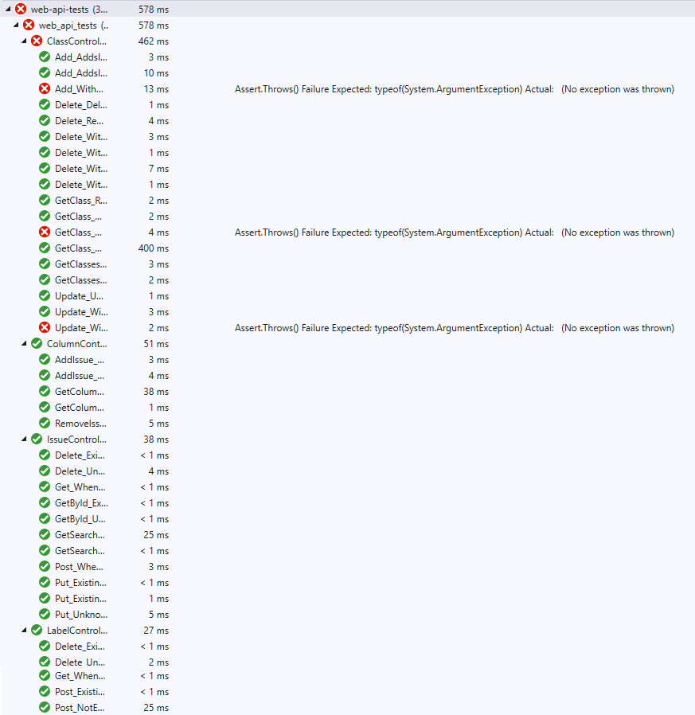
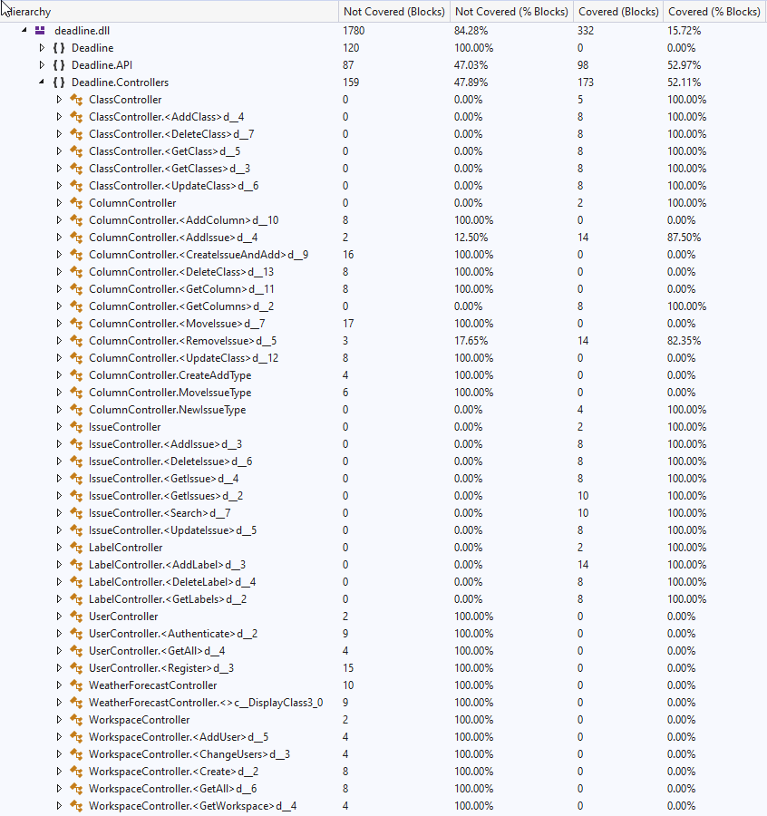
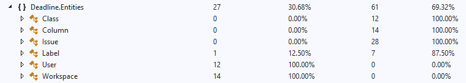
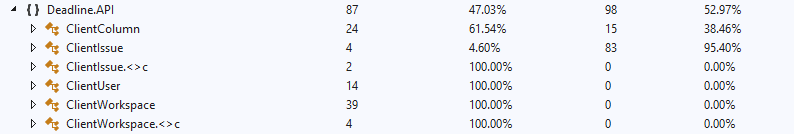

# Egységtesztelés és tesztek kódlefedettségének mérése

## Összefoglalás

A tesztelés során az alkalmazás backend szolgáltatására fókuszáltunk.
Azon belül is a Controllerek tesztelését végeztük, mivel sajnos csak 2 rétegû architektúrát használ a projekt.
A két réteg a Controllerek és a Repository-k, tehát API (Application Programming Interface) és DAL (Data Access Layer).
Mivel nincs külön üzleti logikai réteg (BLL: Business Logic Layer),
ezért a logikát félig a Controllerek, félig a Repository-k valósítják meg.
Ez több szempontból is hátrányos:
- Megnehezíti a tesztelést.
- Rontja a kód bõvíthetõségét.
- Kevésbé átlátható, megérthetõ a kód.
- Nehezen cserélhetõ az adatok perzisztálására szolgáló technológia.
A tesztelés megvalósításához a .NET keretrendszerhez használatos xUnit eszköz segítségét vettük.

## Megvalósítás

Szerencsére az alkalmazás DI használatával kettébontotta a Controller logikát a Repository-tól,
viszont hiányzott egy 3. réteg, ami csak az üzleti logikát tartalmazná.
Továbbá a DI nem interface megvalósítást várt, hanem a konkrét implementációt, ami megnehezítette a mock adatokkal való tesztelést.
Emiatt elõször létre kellett hozni Repository interface-eket, azokat használni a Controllerekben,
illetve a konkrét Repository-knak implementálnia kellett azokat.
Miután ezzel megvoltunk létre kellett hoznunk minden Controllerhez egy-egy hamis Repot, amelyek mock adatokat tudnak visszaadni,
azokon tudnak mûveleteket végezni, hogy ezeket felhasználva sikeresen tudjunk unit tesztelni.
A megvalósított FakeRepository-k segítségével megkezdõdhetett a unit tesztek írása.
Az egységtesztelés során arra törekedtünk, hogy egyszerûbb tesztek segítségével megbizonyosodjunk egy-egy metódus helyes mûködésérõl,
amelyet így összetettebb tesztek írására is fel tudtunk használni.

### Tesztek eredményei

## Konklúzió

A tesztelés során több hibát is találtunk, amelyekre a tesztek hibajelzése mutatott rá.
Az egyszerûbb hibákat igyekeztünk kijavítani, ilyen volt pl. az *IssueRepository* *UpdateIssue* függvénye,
ami akkor is létrehozott és visszaadott egy *ClientIssue* példányt,
amikor az átadott ID nem tartozott valódi rekordhoz.
Valamint fény derült arra is, hogy az IssueRepository esetén a felhasználói ID csupán a
listázó mûveleteknél van figyelembe véve.
Ez biztonsági szempontból nem a legjobb, hiszen ha nincs ID ellenõrzés egy törlési mûveletben,
akkor amennyiben bárki ismeri valamely erõforrásom azonosítóját képes lesz azt törölni.
Végül ezt is sikerült kijavítanunk, így már ezen tesztek is sikeren lefutottak.

### Controllerek tesztlefedettsége

### Entitás és kliens osztályok lefedettsége

## Tanulságok

A feladat elkészítése által betekintést nyerhettünk egy ASP.NET-es web api tesztelésébe, xUnit használatával.
Megerõsítette bennünk azt a gondolkodásmódot, hogy bármilyen jó is egy fejlesztõ, nem lehet tévedhetetlen.
Minden projekt tartalmaz hibákat, amelyek szemmel nehezen észrevehetõek.
Még jól szervezett, átlátható kód esetén is elõfordulnak problémák,
rosszabb minõségû kódról nem is beszélve.
Az ilyen rendellenességek kiszûrésére alkalmas egy jól átgondolt, lehetõleg minden eshetõségre gondoló teszthalmaz.
Segítségével gyorsan észrevehetõ és javítható egy-egy változtatás után létrejövõ hiba.